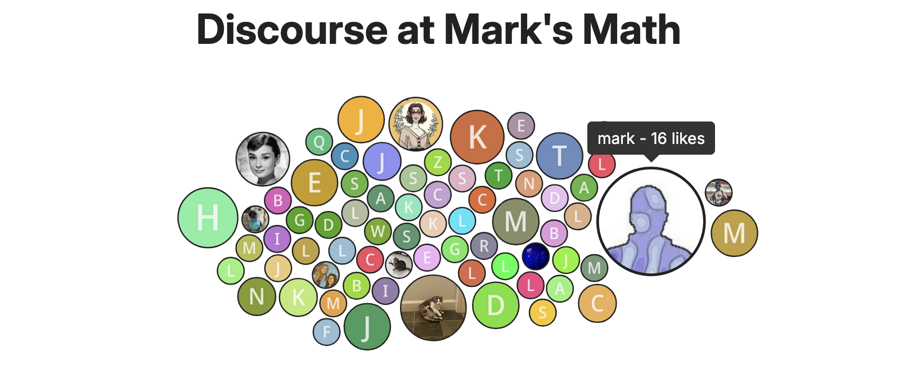

# Discourse-D3-Splash

 Adds a groovy front page animation to a Discourse instance that's based on data from my own Discourse instance. 

 You can see it in action here: https://discourse.marksmath.org/

 On that site, you should see an animated version of a force-directed simulation that congeals into something like so:

 .

 Each circle corresponds to a user. The area of each circle is proportional to the number of like that the user has received. The data is generated by some Python code contained in _admin/getUsersWithLikes.ipynb. In principle, that could be run for any Discourse instance, though, administrator access is required.
 
